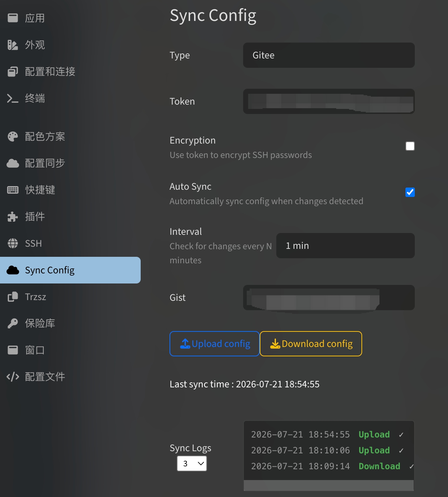

# Sync Config

### For the [Tabby](https://github.com/Eugeny/tabby) terminal

This plugin can sync configuration files to GitHub Gist, Gitee Gist, or GitLab Snippet.

## Features

- **Multi-platform support** — GitHub Gist, Gitee Gist, GitLab Snippet (including self-hosted GitLab)
- **Upload & Download** — Manually upload local config to remote or download remote config to local
- **Auto Sync** — Automatically detect local/remote changes and sync accordingly
- **Encryption** — Use token to AES-encrypt SSH passwords before syncing
- **Sync Logs** — View recent sync history with time, direction, status, and error messages

## Configuration

| Option | Description |
| --- | --- |
| **Type** | Sync platform: `Off`, `GitHub`, `Gitee`, `GitLab` |
| **Instance URL** | (GitLab only) Self-hosted GitLab URL, e.g. `https://gitlab.example.com` |
| **Token** | API token for the selected platform |
| **Encryption** | Enable AES encryption for SSH passwords using the token as key |
| **Auto Sync** | Automatically sync when local or remote changes are detected |
| **Interval** | Auto sync check interval: 1, 3, 5, 10, or 30 minutes |
| **Gist** | Gist/Snippet ID — required, the plugin will update the existing gist (not create a new one) |
| **Sync Logs** | Recent sync history display, configurable to show 3, 5, 10, or 20 entries |

## Usage

1. Select a sync platform (GitHub / Gitee / GitLab)
2. Enter your API token
3. Fill in an existing Gist/Snippet ID
4. Click **Upload config** to push local config, or **Download config** to pull remote config
5. Optionally enable **Auto Sync** for automatic bidirectional syncing

> **Note:** A Gist ID is required for both upload and download. The plugin will only update the existing gist/snippet and will not create a new one.

---

Like my work?

